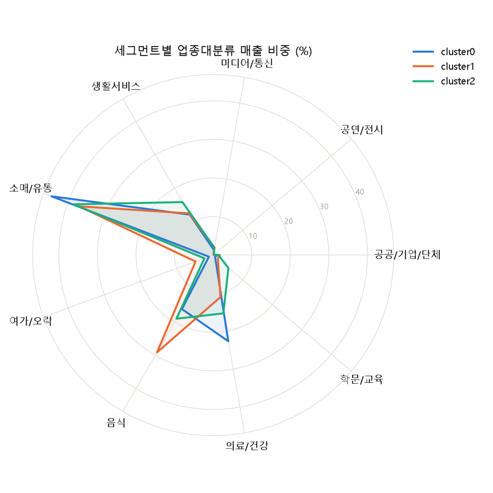
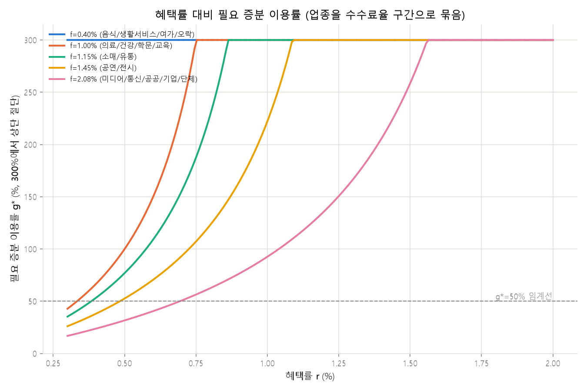

# 결제 데이터 기반 카드 혜택 설계 프로젝트

IT 직무 지원용 데이터 분석 포트폴리오 프로젝트 (카드사 결제 데이터를 소재로 함). 기획자 1인, 데이터 분석/개발 담당(본인) 1인으로 진행했다. 상세 기획은 [PROJECT_SPEC.md](PROJECT_SPEC.md) 참조.

## 문제 정의

카드사 마케팅은 상품이 아니라 서비스 마케팅이다 — 매 결제 순간 선택받아야 하므로 혜택은
"많이"가 아니라 "맞게" 줘야 한다. 그런데 여기에 구조적 긴장이 있다: 고객이 원하는 혜택은
마트·주유·통신 같은 생활 밀착 업종에 몰려 있는데, 이 업종들은 가맹점 수수료율이 낮아
카드사가 혜택 비용을 회수하기 어렵다. 이 프로젝트는 이 긴장을 실제 소비 데이터로 정량화하고,
혜택 구조가 성립 가능한 지점(또는 성립하려면 무엇이 바뀌어야 하는지)을 찾는다.
(이 절은 데이터 분석 결과가 아니라 프로젝트 출발점의 문제의식이므로 [미검증] 대상이 아님 —
상세 배경은 PROJECT_SPEC.md 1절 참조.)

## 협업 방식

기획자와 나는 이 프로젝트에서 우선순위가 처음부터 달랐다. 기획자는 "고객이 그 결제
순간에 실제로 체감하는 혜택 경험"을 최우선으로 뒀고, 나는 "그 경험이 손익·데이터
구조 위에서 실제로 버티는가"를 최우선으로 뒀다. 이 온도차는 특히 두 지점에서 정면으로
부딪혔고, 그 충돌을 그대로 남겨두는 게 이 프로젝트의 결론을 더 정직하게 만든다고
판단해 기록한다.

### 충돌 1 — 세그먼트를 얼마나 잘게 쪼갤 것인가

기획자는 초기 기획 단계에서 [업종 × 시간대 × 요일] 조합으로 훨씬 세밀한 개인화
세그먼트를 제안했다 — 예를 들어 평일 아침에는 카페 혜택을, 금요일 저녁에는 외식
혜택을 노출하는 식으로, 사용자가 그 순간 체감할 수 있는 경험을 설계하고
싶어했다. 나는 실제로 L2 클러스터링을 돌려본 뒤 시간대·요일 축의 영향은 미미하고
연령대가 지배적 축이라는 결과(H4)를 들고 반대했다 — 세그먼트를 그렇게까지 잘게
쪼개면 세그먼트당 표본이 줄어 g* 추정이 흔들리고, 운영 중에도 세그먼트 경계가
계속 재조정돼야 하는 불안정한 시스템이 된다는 게 내 논지였다. 기획자는 그
분석 결과 자체는 인정하면서도, 세그먼트 정의 축에서 빠진다고 해서 시간대·요일이
사용자 경험 측면에서 갖는 의미까지 사라지는 것은 아니라고 반박하며 쉽게
물러서지 않았고, 몇 차례 더 논의한 끝에 절충안으로 합의했다 — [연령대]는
세그먼트를 나누는 축으로 유지하되, [시간대·요일]은 세그먼트 정의가 아니라
"혜택을 언제 노출할지"를 정하는 운영 변수로 위치를 바꾼 것이다. 카드 상품 3안
표의 "피크 시간대" 컬럼이 그 타협의 결과물이다 — 클러스터를 나누는 축으로는
쓰지 않았지만, 세그먼트별로 매출이 가장 높았던 시간대·요일을 집계해(peak_hour,
peak_day) 상품 노출 시점으로 반영했다.
(근거: docs/hypothesis-log.md H4, outputs/tables/segment_profile.csv, src/03_segment.py)

### 충돌 2 — 즉시할인이냐, 이연적립/연회비 구조냐

기획자는 혜택이 결제 순간 바로 체감돼야 카드가 선택받는다는 입장이었고,
특히 음식은 2위 지출 업종이면서 이용 빈도가 높아 고객이 혜택을 가장 직접적으로
체감할 수 있는 영역이라 즉시할인을 유지해야 한다고 제안했다. 나 역시 음식이
사용자 입장에서 매력적인 혜택이라는 점에는 동의했지만, g* 계산 결과(음식 업종
즉시할인 g*=300%, threshold 50%를 크게 초과)를 근거로 지금 구조로는 지속하기
어렵다고 반박했다 — 이 상태로 즉시할인을 강행하면 출시 이후 손익을 못 버텨
혜택을 도로 줄이거나 상품 자체를 접어야 하는 상황이 온다는 우려였다. 즉
"혜택을 포기해야 한다"가 아니라 "사용자에게 중요한 혜택이라는 점은 인정하지만
현재 구조로는 지속할 수 없다"는 입장이었던 셈이다. 이 지점에서 몇 차례
논의한 끝에, 기획자도 처음에는 혜택을 포기하기 어렵다는 입장이었지만 계산
결과를 받아들여 세그먼트별로 손익 구조를 다시 확인하는 쪽으로 방향을
바꿨고, 결국 세그먼트별로 다른 답을 낸다는 쪽으로 정리했다. cluster2는
연회비 선회수 구조로 기획자가 원했던 수준의 혜택 크기를 지킬 여력이
있었지만(연회비 풀의 약 20% 배정으로 충족), cluster1은 이연적립만으로는
부족했다 — threshold 충족에 소멸률 55.6%가 필요한데 가정치는 30%였다.
기획자도 이 계산 앞에서는 cluster1에 원했던 즉시성 있는 혜택을 그대로 줄 수
없다는 결론에 동의했고, 대신 cluster1은 소매/유통 혜택에 집중하고 음식
혜택은 추후 과제로 남기기로 했다.
(근거: outputs/tables/structural_alternatives.csv, docs/hypothesis-log.md H8)

두 충돌 모두 최종 결정권을 누가 가져갔다기보다, 기획자가 던진 "사용자가 원하는가"라는
질문과 내가 던진 "숫자가 버티는가"라는 질문이 서로를 검증하며 결과를 좁혀간 과정에
가깝다. 카드 상품 3안(아래)과 구조 실험 결과 표는 이 두 충돌의 타협안이 그대로
반영된 결과물이다.

두 충돌을 겪으며 확인한 건, 협업이 서로의 의견을 적당히 절충하는 게 아니라 각자
자기 기준을 충분히 주장하되 더 나은 근거가 나오면 그 판단을 실제로 수정하는
과정이라는 점이다. 충돌 1에서는 내가 "가장 단순하고 안정적인 시스템"을 최선으로
봤지만 기획자의 문제제기를 받아들여 시간대·요일을 다른 방식(운영 변수)으로 살렸고,
충돌 2에서는 반대로 기획자가 g* 계산 결과 앞에서 "모든 고객에게 동일한 음식
즉시할인"이라는 기존 입장을 접고 세그먼트별로 다른 답을 인정했다. 결국 이 프로젝트는
"기획자는 경험, 개발자는 안정성"처럼 역할을 나눠 각자 맡은 몫만 처리한 결과물이
아니라, 서로 다른 기준을 가진 두 사람이 계속 부딪히고 의견을 주고받으며 하나의
상품 구조로 좁혀 온 결과물에 가깝다.

## 방법

1. L1 기술통계 — 데이터 지형 파악
2. L2 소비 리듬 세그먼트 — [업종 × 시간대 × 요일] 벡터 클러스터링
   (→ 실제 결과는 시간대·요일 축의 영향이 미미하고 연령대가 지배적 축으로 나옴.
   가설과 결과가 어긋난 경위는 "주요 발견 요약" 참조)
3. L3 수익성 역산 — 세그먼트 × 업종별 g*(필요 증분 이용률) 히트맵, 카드 상품 3안
4. L4 민감도 분석 — 가정치를 흔들었을 때 결론이 유지되는 범위

## 주요 발견 요약 (근거 기반, 해석은 아래 "결론"에서)

- **유입형 상권 문제**: 성남시 등 9개 행정동(전체 426개 중)이 사업자 카드가맹점 주소
  집중으로 매출의 48.9%를 차지 — 제외 처리함. 포함 여부에 따라 미디어/통신 매출 비중이
  1.86%↔22.17%로 바뀔 만큼 결정적이었음.
  (근거: docs/limitations.md 2번, outputs/tables/sensitivity.csv)
- **세그먼트**: 성별×연령×시간대×요일로 세그먼트를 나누려 했으나, 실제로는 성별·시간대·
  요일의 영향은 미미하고 연령대(청년/중장년/고령 3단계)가 지배적 축이었음 — 애초 가설과
  반대 방향.
  (근거: docs/hypothesis-log.md H4, outputs/tables/segment_profile.csv)
- **손익분기 역산**: 업종별 수수료율 가정(0.40%~2.08%) 기준, 음식·생활서비스·여가오락처럼
  고객이 일상적으로 선호하는 업종은 혜택률 0.5%만 돼도 손익분기 자체가 성립하지 않음
  (r ≥ f이면 g*=∞). 반면 미디어/통신 등은 r=1.0%에서도 g*=93% 수준.
  단, 이 결론은 혜택 비용을 카드사가 단독 전액 부담한다는 가정 위에서만 성립한다 —
  즉 "일상 소비 업종은 할인이 불가능하다"가 아니라 "카드사 단독 부담 구조로는 불가능하며,
  성립하려면 제휴사 비용 분담·연회비 선회수·실적조건부 이연 적립·혜택 대상을 특정
  시간대로 좁히는 것 같은 구조 변경이 필요하다"로 읽어야 함 (대안 방향: PROJECT_SPEC.md
  2절 "확장 논점").
  (근거: docs/hypothesis-log.md H1·H2, outputs/tables/bep_heatmap.csv)
- **민감도 — 축에 따라 견고함이 갈림**: "소매/유통이 모든 세그먼트에서 1위 지출처"라는
  결론은 k(세그먼트 개수)를 바꿔도 유지되어 **k 축에는 견고**하다. 반대로 아래 탄력성
  축에는 취약하다 — 같은 결론이라도 어떤 가정을 흔드느냐에 따라 결과가 다르다는 뜻이므로
  "견고하다"고 쓸 때는 어느 축에 대한 견고함인지 구분해야 한다. "일상 소비 업종은 할인이
  아예 불가능하다"는 결론도 업종→수수료구간 매핑을 한 단계만 낙관적으로 바꾸면 뒤집혀 —
  프로젝트에서 가장 근거가 약한 가정에 결론의 상당 부분이 기대고 있음을 그대로 남긴다.
  (근거: outputs/tables/sensitivity.csv 1·3번 항목)
- **탄력성 반영 시 "성립"의 기준이 완전히 달라짐, 그리고 그 가정 자체도 흔들어봄**: g*는
  수식 구조상 f·r에만 의존하고 세그먼트 변수가 없다. 세그먼트별 혜택 반응 탄력성 가정
  (근거 얇은 판단치, config/assumptions.yaml)을 더해 "실제 달성 가능한 증분 이용률"과
  g*를 비교하면, threshold(g*≤50%) 기준으로 성립하는 486개 조합 중 탄력성 기준까지
  통과하는 건 6개뿐(전부 cluster1의 미디어/통신·공공/기업/단체, r=0.3~0.5%) — "k를
  바꿔도 유지되는 견고한 결론"이라던 소매/유통조차 세 세그먼트 전부 탄력성 기준으로는
  탈락한다. 다만 이 6개라는 결과가 "혜택이 정말 그만큼 어렵다"가 아니라 "가정치가 너무
  보수적이다"일 가능성을 배제할 수 없어, 탄력성 가정치를 0.5~10배로 흔들어봤다 — 배수를
  10배까지 올려도 g*가 유한한 222개 조합 중 154개(threshold까지 동시 충족은 39개)에
  그쳐 전부는 풀리지 않는다. 다만 세그먼트 1위 업종(소매/유통)만 보면 성립에 필요한
  배수가 세그먼트마다 다르다 — cluster1(청년)은 1.76배, cluster2(중장년)는 3.53배,
  cluster0(고령)은 7.06배만 가정치를 올리면 r=0.3%에서 성립한다. 즉 "가정이
  과보수적이었다"는 설명은 부분적으로는 설득력이 있지만 전부를 설명하지는 못한다.
  (근거: outputs/tables/bep_heatmap.csv, outputs/tables/sensitivity.csv 4a·4b,
  src/04_economics.py, src/05_report.py, docs/hypothesis-log.md H7·H9)
- **혜택 구조를 바꾸면 결과가 갈림**: 즉시할인으로는 불가능했던 2위 지출 업종(음식,
  r=0.3%에서 g*=300%)에 이연적립(cluster1)·연회비 선회수(cluster2)를 적용해봄. 이연적립은
  가정 소멸률(30%) 기준 g*가 110.5%까지 내려오지만 threshold(50%)를 넘어 여전히 불가 —
  threshold 충족에는 소멸률 55.6%가 필요해 가정치로는 부족함. 연회비 선회수는 세그먼트
  전체 연회비 수입 풀(월 약 118억원, 카드 약 946만 장 추정) 중 약 20%만 음식 카테고리에
  배정해도 threshold를 충족함 — 같은 "대안" 목록 안에서도 실제로 계산해보니 하나는
  부족하고 하나는 여유가 있었다.
  (근거: outputs/tables/structural_alternatives.csv, src/04_economics.py,
  docs/hypothesis-log.md H8)
- **실제 시장 상품과 대조해도 결론이 안 흔들림, 오히려 새 메커니즘을 발견**: "실제로는
  카드 혜택 상품이 많은데 이 결론이 너무 비관적인 거 아니냐"를 확인하려고 실제 판매
  중인 카드 상품(대형마트 10% 할인, 월 한도 15,000원, 전월실적 150만원 이상 —
  2026-08-27 웹 검색 확인)을 모델에 넣어봤다. 명목 10%는 f(1.15%)보다 훨씬 커서 그대로
  못 쓰고, 월 한도로 낮아지는 실효 혜택률을 지출액별로 계산하면 월 130만원 이상 써야
  겨우 f 아래로 내려오는데, 그 지점에서도 g*=666.7%로 threshold(50%)의 13배다. 즉
  월 한도는 이 프로젝트의 즉시할인 마진 모델을 성립시키는 장치가 아니었다 —
  전월실적 조건으로 다른 업종 소비까지 끌어들이는 락인, 절대 손실액을 세그먼트 단위로
  감당 가능한 수준으로 캡핑하는 것처럼, 이 프로젝트가 애초에 모델링하지 않은 방식으로
  손익을 맞추고 있을 가능성을 시사한다. 결론을 반증하려던 시도가 결론을 강화하고 새
  메커니즘을 드러낸 사례.
  (근거: outputs/tables/sensitivity.csv 5번 항목, src/05_report.py,
  docs/hypothesis-log.md H10)

## 카드 상품 3안 (초안 — 검토 필요)

세그먼트별 g* 히트맵에서 손익분기가 성립하는 업종·혜택률만 골라 구성한 초안이다.
전략·리스크 서술은 AI가 초안을 잡은 것이므로 그대로 채택하지 말고 검토 후 다듬을 것.
(근거: outputs/tables/product_proposals.csv, outputs/tables/bep_heatmap.csv,
src/04_economics.py)

| 상품안 | 타겟 세그먼트 | 즉시할인 업종·혜택률 | g*(즉시할인) | 피크 시간대 | 핵심 전략 |
|---|---|---|---|---|---|
| cluster0 — 금·13-15시 고액결제형 | F/M 60대 이상 | 소매/유통 0.3%, 의료/건강 0.3% | 35.3% / 42.9% | 금 13-15시 | 즉시할인 성립 업종만 혜택. 3위 지출인 음식(f=0.40%)은 할인 불가해 제외 |
| cluster1 — 토·17-19시 소액결제형 | F/M 10~20대 | 소매/유통 0.3% | 35.3% | 토 17-19시 | 소매/유통만 즉시할인 성립. 2위 지출인 음식은 이연적립 구조를 검토했으나 아래 참조 |
| cluster2 — 토·15-17시 중간결제형 | F/M 30~60대 | 소매/유통 0.3% | 35.3% | 토 15-17시 | 최대 볼륨 세그먼트(월 1.4억 건). 2위 지출인 음식은 연회비 선회수 구조로 확장 가능(아래 참조) |

**2위 지출 업종(음식)에 대한 구조 실험 결과** (근거: outputs/tables/structural_alternatives.csv):

| 세그먼트 | 구조 | 즉시할인 g* | 구조 적용 후 g* | threshold(50%) 충족? |
|---|---|---|---|---|
| cluster1 | 이연적립 (가정 소멸률 30%) | 300% | 110.5% | **미충족** — threshold 충족에는 소멸률 55.6% 필요, 가정치보다 높음 |
| cluster2 | 연회비 선회수 (연회비 15,000원/년 가정) | 300% | 연회비 풀의 약 20% 배정 시 충족 | **충족** — 세그먼트 카드수 약 946만 장 추정 기준 |

즉, "즉시할인이 안 되면 대안 구조로 전환한다"는 스펙 상의 방향이 두 세그먼트에서 같은
결과를 내지 않았다 — cluster2는 음식 혜택을 연회비로 지탱할 여지가 있지만, cluster1은
이연적립만으로는 부족해 추가 조치(더 높은 소멸률을 가정할 근거를 찾거나, 음식 혜택을
포기하거나, 다른 구조를 검토)가 필요하다.

**탄력성 가정을 반영하면 위 g*(즉시할인) 판정 자체도 재검토가 필요하다** — 세그먼트별
혜택 반응 탄력성(근거 얇은 판단치)을 적용하면 세 상품안의 소매/유통 혜택(threshold
기준으로는 전부 성립)이 탄력성 기준으로는 **전부 탈락**한다. 이 표의 "g*(즉시할인)"
열은 threshold 기준일 뿐, 실제 달성 가능성까지 보장하지 않는다는 점을 결론 작성 시
반영할 것. (근거: outputs/tables/bep_heatmap.csv, docs/hypothesis-log.md H7)

## 시각화




(근거: outputs/figures/, src/03_segment.py, src/04_economics.py.
시간대·요일 소비 곡선은 outputs/figures/consumption_rhythm.png 참조.)

## 결론

(아래는 작성용 개요 — 최종 문장은 사용자가 직접 쓴다. CLAUDE.md 규칙 4:
자소서·면접에서 본인 언어로 설명 가능해야 하므로 AI가 완성 문장을 대신 쓰지 않는다.)

**줄거리 축**: "혜택을 얼마 줄까"로 시작한 질문이, 분석을 거치며 "혜택을 줄 수 있는
구조인가"로 바뀌었다. 이 프로젝트를 관통하는 한 문장은 이 전환이다 — 아래 여섯
재료는 전부 이 전환의 증거로 나열할 것이지, 각각을 독립된 발견으로 늘어놓지 말 것.

1. **유입형 상권 → 데이터를 의심하는 태도가 결과를 구함**
   불붙일 소재: 9개 행정동(전체 426개 중)이 매출의 48.9%를 차지, 포함 여부로
   미디어/통신 비중이 1.86%↔22.17%로 10배 이상 흔들림. 이 처리를 안 했으면 사업자
   카드가맹점 데이터를 소비자 소비로 착각한 채 전체 결론이 왜곡됐을 것.
   불붙일 문장: [본인 언어로 — "왜 이 처리가 데이터분석 역량의 핵심인지"]

2. **시간대·요일 가설이 깨짐 → 설계 의도가 데이터에 부정된 기록**
   차별점으로 삼으려던 [업종×시간대×요일] 소비 리듬 축이 실제로는 무의미했고,
   연령대가 지배적 축이었음(H4). 카드사가 원하는 역량은 "정교한 가설을 세우는 것"이
   아니라 "가설이 틀렸을 때 데이터를 따라가는 것"이라는 논지로 연결 가능.
   불붙일 문장: [본인 언어로]

3. **손익분기의 가혹함 → 서비스마케팅으로서의 카드 혜택**
   음식·생활서비스·여가오락처럼 고객이 일상적으로 원하는 업종은 혜택률 0.5%만 돼도
   손익분기가 성립하지 않음(g*=∞, H1·H2). 이건 "카드사 단독 부담" 가정에서만
   성립 — 카드는 상품마케팅이 아니라 서비스마케팅이라, 매 결제 순간 선택받아야 하는데
   정작 고객이 원하는 업종일수록 카드사 혼자서는 혜택을 감당 못 한다는 구조적 긴장이
   여기서 숫자로 드러남.
   불붙일 문장: [본인 언어로 — "균형점을 찾는다는 게 실무에서 무슨 뜻인지"]

4. **구조 실험의 비대칭 → 왜 실제 카드사가 연회비·실적조건을 쓰는가**
   같은 "대안"으로 나열됐던 이연적립(cluster1)과 연회비 선회수(cluster2)가 실제로
   계산해보니 갈렸다(H8) — 이연적립은 가정 소멸률로는 부족했고, 연회비 선회수는
   연회비 풀의 약 20%만으로 충족됐다. 성립 여부를 미리 정해두지 않고 계산했다는 게
   이 비대칭 자체로 증명됨. "그래서 실제 카드가 연회비를 받고 즉시할인 대신 적립을
   주는가"에 대한 계산된 답.
   불붙일 문장: [본인 언어로]

5. **세그먼트별 필요 배수 → "고객 이해"를 숫자로 번역한 지점**
   같은 결론(threshold엔 성립)도 탄력성 기준을 대면 세그먼트마다 갈렸다(H7·H9) —
   청년층은 가정치를 1.76배만 올려도 성립, 고령층은 7.06배가 필요. 실무 언어로
   옮기면 "청년층 대상 혜택 설계는 가정이 조금만 유리해도 성립하지만, 고령층은
   어지간해선 안 된다"는 문장이 된다. 다만 이 7.06배가 가정치 편향 때문인지 고령층의
   실제 특성 때문인지는 이 데이터로는 구분 불가능하다는 것도 숨기지 않았다(H9) — 이
   "모른다"는 것 자체가 유입형 상권 발견부터 이어지는 이 프로젝트의 태도임을 강조할 것.
   불붙일 문장: [본인 언어로 — "고객 이해"가 카드사 데이터분석에서 왜 중요한 역량인지
   본인 경험과 연결]

6. **실제 상품과 대조 → 결론을 스스로 반증하려다 오히려 강화·확장함**
   "실제로는 카드 혜택이 흔한데 이 결론은 너무 비관적인 거 아니냐"는 예상 질문에 미리
   답해본 지점(H10). 실제 판매 중인 카드(대형마트 10% 할인, 월 한도 15,000원)를
   모델에 넣어보니, 월 한도가 아무리 실효 혜택률을 낮춰도 g*는 threshold의 13배
   수준에 머물렀다 — 결론이 안 흔들렸을 뿐 아니라, 이 프로젝트가 원래 모델링하지 않은
   메커니즘(전월실적 락인, 손실액 자체를 캡핑)이 실제로는 손익분기 방정식보다 더 크게
   작동하고 있을 가능성을 새로 드러냈다. "내 결론을 내가 먼저 깨보려 했다"는 태도의
   가장 직접적인 증거.
   불붙일 문장: [본인 언어로 — 면접에서 "그런데 실제로는 혜택 카드가 잘 나오는데요?"
   질문에 바로 쓸 수 있는 답]

**결론에서 다룰 필요는 없지만 참고할 맥락**: 신용한도·적정금리 산정은 이 프로젝트
데이터(결제·소비 집계)로는 다룰 수 없는 영역이다(신용정보·심사 데이터가 별도로
필요). "결제 데이터로 소비 패턴과 수익성 구조까지는 역산해봤고, 이걸 신용평가
데이터와 결합하면 금리·한도 정책까지 이어질 수 있겠다"는 정도의 향후 확장 방향으로만
언급하고, 이 프로젝트가 실제로 그 계산을 했다고 쓰지 말 것 — 하지 않은 분석을 한 것처럼
쓰면 CLAUDE.md 규칙 1 위반.

## 한계

[docs/limitations.md](docs/limitations.md) 참조.

## 재현 방법

```
pip install -r requirements.txt
python src/01_load.py
python src/02_clean.py
python src/03_segment.py
python src/04_economics.py
python src/05_report.py
```

원본 데이터는 저장소에 포함되지 않는다. `data/raw/`에 아래를 받아 배치할 것:
- 공공데이터포털 — 경기도 카드 소비 데이터 (+ 경기도 민간데이터 규격서)
- 여신금융협회 가맹점 수수료율 공시
