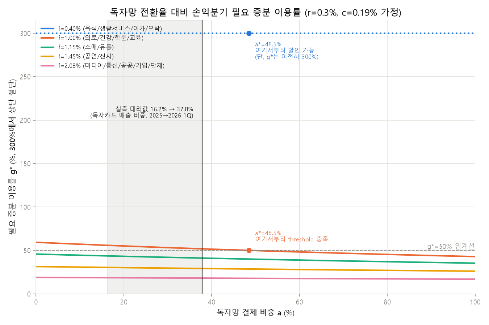

# 결제 데이터 기반 카드 혜택 설계 프로젝트

IT 직무 지원용 데이터 분석 포트폴리오 프로젝트 (카드사 결제 데이터를 소재로 함). 기획자 1인, 데이터 분석/개발 담당(본인) 1인으로 진행했다. 상세 기획은 [PROJECT_SPEC.md](PROJECT_SPEC.md) 참조.

## 문제 정의

카드사 마케팅은 상품이 아니라 서비스 마케팅이다 — 매 결제 순간 선택받아야 하므로 혜택은
"많이"가 아니라 "맞게" 줘야 한다. 그런데 여기에 구조적 긴장이 있다: 고객이 원하는 혜택은
마트·주유·통신 같은 생활 밀착 업종에 몰려 있는데, 이 업종들은 가맹점 수수료율이 낮아
카드사가 혜택 비용을 회수하기 어렵다. 이 프로젝트는 이 긴장을 실제 소비 데이터로 정량화하고,
혜택 구조가 성립 가능한 지점(또는 성립하려면 무엇이 바뀌어야 하는지)을 찾는다.
(이 절은 데이터 분석 결과가 아니라 프로젝트 출발점의 문제의식이므로 [미검증] 대상이 아님 —
상세 배경은 PROJECT_SPEC.md 1절 참조.)

## 협업 방식

기획자와 나는 이 프로젝트에서 우선순위가 처음부터 달랐다. 기획자는 "고객이 그 결제
순간에 실제로 체감하는 혜택 경험"을 최우선으로 뒀고, 나는 "그 경험이 손익·데이터
구조 위에서 실제로 버티는가"를 최우선으로 뒀다. 이 온도차는 특히 두 지점에서 정면으로
부딪혔고, 그 충돌을 그대로 남겨두는 게 이 프로젝트의 결론을 더 정직하게 만든다고
판단해 기록한다.

### 충돌 1 — 세그먼트를 얼마나 잘게 쪼갤 것인가

기획자는 초기 기획 단계에서 [업종 × 시간대 × 요일] 조합으로 훨씬 세밀한 개인화
세그먼트를 제안했다 — 예를 들어 평일 아침에는 카페 혜택을, 금요일 저녁에는 외식
혜택을 노출하는 식으로, 사용자가 그 순간 체감할 수 있는 경험을 설계하고
싶어했다. 나는 실제로 L2 클러스터링을 돌려본 뒤 시간대·요일 축의 영향은 미미하고
연령대가 지배적 축이라는 결과(H4)를 들고 반대했다 — 세그먼트를 그렇게까지 잘게
쪼개면 세그먼트당 표본이 줄어 g* 추정이 흔들리고, 운영 중에도 세그먼트 경계가
계속 재조정돼야 하는 불안정한 시스템이 된다는 게 내 논지였다. 기획자는 그
분석 결과 자체는 인정하면서도, 세그먼트 정의 축에서 빠진다고 해서 시간대·요일이
사용자 경험 측면에서 갖는 의미까지 사라지는 것은 아니라고 반박하며 쉽게
물러서지 않았고, 몇 차례 더 논의한 끝에 절충안으로 합의했다 — [연령대]는
세그먼트를 나누는 축으로 유지하되, [시간대·요일]은 세그먼트 정의가 아니라
"혜택을 언제 노출할지"를 정하는 운영 변수로 위치를 바꾼 것이다. 카드 상품 3안
표의 "피크 시간대" 컬럼이 그 타협의 결과물이다 — 클러스터를 나누는 축으로는
쓰지 않았지만, 세그먼트별로 매출이 가장 높았던 시간대·요일을 집계해(peak_hour,
peak_day) 상품 노출 시점으로 반영했다.
(근거: docs/hypothesis-log.md H4, outputs/tables/segment_profile.csv, src/03_segment.py)

### 충돌 2 — 즉시할인이냐, 이연적립/연회비 구조냐

기획자는 혜택이 결제 순간 바로 체감돼야 카드가 선택받는다는 입장이었고,
특히 음식은 2위 지출 업종이면서 이용 빈도가 높아 고객이 혜택을 가장 직접적으로
체감할 수 있는 영역이라 즉시할인을 유지해야 한다고 제안했다. 나 역시 음식이
사용자 입장에서 매력적인 혜택이라는 점에는 동의했지만, g* 계산 결과(음식 업종
즉시할인 g*=300%, threshold 50%를 크게 초과)를 근거로 지금 구조로는 지속하기
어렵다고 반박했다 — 이 상태로 즉시할인을 강행하면 출시 이후 손익을 못 버텨
혜택을 도로 줄이거나 상품 자체를 접어야 하는 상황이 온다는 우려였다. 즉
"혜택을 포기해야 한다"가 아니라 "사용자에게 중요한 혜택이라는 점은 인정하지만
현재 구조로는 지속할 수 없다"는 입장이었던 셈이다. 이 지점에서 몇 차례
논의한 끝에, 기획자도 처음에는 혜택을 포기하기 어렵다는 입장이었지만 계산
결과를 받아들여 세그먼트별로 손익 구조를 다시 확인하는 쪽으로 방향을
바꿨고, 결국 세그먼트별로 다른 답을 낸다는 쪽으로 정리했다. cluster2는
연회비 선회수 구조로 기획자가 원했던 수준의 혜택 크기를 지킬 여력이
있었지만(연회비 풀의 약 20% 배정으로 충족), cluster1은 이연적립만으로는
부족했다 — threshold 충족에 소멸률 55.6%가 필요한데 가정치는 30%였다.
기획자도 이 계산 앞에서는 cluster1에 원했던 즉시성 있는 혜택을 그대로 줄 수
없다는 결론에 동의했고, 대신 cluster1은 소매/유통 혜택에 집중하고 음식
혜택은 추후 과제로 남기기로 했다.
(근거: outputs/tables/structural_alternatives.csv, docs/hypothesis-log.md H8)

### 내가 양보한 지점 — 세그먼트 구조

초기에는 데이터 분석 결과를 근거로 시간대·요일을 세그먼트에서 제외하고, 연령대를
중심으로 단순한 세그먼트 구조를 유지하는 것이 가장 안정적이라고 판단했다. 개발
관점에서는 세그먼트를 단순하게 유지할수록 세그먼트당 표본 수를 확보할 수 있고,
손익분기 추정(g*)과 운영 기준도 흔들림 없이 관리할 수 있기 때문이다.
(근거: docs/hypothesis-log.md H4, outputs/tables/segment_profile.csv, src/03_segment.py)

그러나 기획자와 논의하면서 시간대·요일을 세그먼트 축에서 제거하는 것이 사용자
입장에서는 혜택의 개인화 경험 자체를 약화시킬 수 있다는 점을 받아들였다. 나는 데이터
분석 결과에 따라 시간대·요일을 완전히 제외하려던 기존 설계를 포기했다. 내가 선호했던
세그먼트 구조를 그대로 구현하는 대신, 시간대·요일을 세그먼트 정의에서 분리해 혜택
노출 시점을 결정하는 운영 변수로 활용하는 방향을 선택했다.

대신 그 양보로 생길 수 있는 문제를 기획자 쪽에 떠넘기지는 않았다. 내가 우려했던
세그먼트 복잡도 증가와 손익 추정의 불안정성은, 시간대·요일을 세그먼트 축에서는 끝까지
제외하고 운영 변수로만 관리하는 방식으로 내가 설계해 통제했다 — 세그먼트를 나누는
축은 연령대만 유지해 세그먼트당 표본 수와 g* 추정의 안정성을 지켰고, 시간대·요일은
세그먼트별 매출 피크(peak_hour, peak_day)를 집계해 "언제 노출할지"만 정하는 운영
파라미터로 쓰이게 해서 운영 중에 세그먼트 경계가 다시 흔들릴 여지를 남기지 않았다.
(근거: outputs/tables/segment_profile.csv, src/03_segment.py, 카드 상품 3안 표의
"피크 시간대" 컬럼)

결과적으로 내가 원했던 구조를 그대로 적용할 기회는 포기했지만, 기획자가 중요하게
생각한 사용자 경험까지 버리지는 않았다. 이 과정에서 팀 성과를 위한 양보는 내 의견을
무조건 포기하는 것이 아니라, 내 역할에서 중요하게 생각하는 기준을 일부 내려놓더라도
상대의 요구를 살릴 수 있는 다른 방법을 찾아 전체 결과물의 완성도를 높이는 것임을
배웠다.

두 충돌 모두 최종 결정권을 누가 가져갔다기보다, 기획자가 던진 "사용자가 원하는가"라는
질문과 내가 던진 "숫자가 버티는가"라는 질문이 서로를 검증하며 결과를 좁혀간 과정에
가깝다. 카드 상품 3안(아래)과 구조 실험 결과 표는 이 두 충돌의 타협안이 그대로
반영된 결과물이다.

두 충돌을 겪으며 확인한 건, 협업이 서로의 의견을 적당히 절충하는 게 아니라 각자
자기 기준을 충분히 주장하되 더 나은 근거가 나오면 그 판단을 실제로 수정하는
과정이라는 점이다. 충돌 1에서는 내가 최선이라 봤던 "가장 단순하고 안정적인 시스템"을
그대로 관철하는 대신 시간대·요일을 운영 변수로 살려냈고(위 "내가 양보한 지점"),
충돌 2에서는 반대로 기획자가 g* 계산 결과 앞에서 "모든 고객에게 동일한 음식
즉시할인"이라는 기존 입장을 접고 세그먼트별로 다른 답을 인정했다. 결국 이 프로젝트는
"기획자는 경험, 개발자는 안정성"처럼 역할을 나눠 각자 맡은 몫만 처리한 결과물이
아니라, 서로 다른 기준을 가진 두 사람이 계속 부딪히고 의견을 주고받으며 하나의
상품 구조로 좁혀 온 결과물에 가깝다.

## 방법

1. L1 기술통계 — 데이터 지형 파악
2. L2 소비 리듬 세그먼트 — [업종 × 시간대 × 요일] 벡터 클러스터링
   (→ 실제 결과는 시간대·요일 축의 영향이 미미하고 연령대가 지배적 축으로 나옴.
   가설과 결과가 어긋난 경위는 "주요 발견 요약" 참조)
3. L3 수익성 역산 — 세그먼트 × 업종별 g*(필요 증분 이용률) 히트맵, 카드 상품 3안
4. L4 민감도 분석 — 가정치를 흔들었을 때 결론이 유지되는 범위
5. L5 모델 확장 — 실제 시장 상품(원더카드 2.0·하나카드 19149) 투입, 그리고 손익식의 f를
   이원 결제망(독자망 / BC 대행망)으로 분리해 결제망이 혜택 여력을 얼마나 바꾸는지 계산

## 주요 발견 요약 (근거 기반, 해석은 아래 "결론"에서)

- **유입형 상권 문제**: 성남시 등 9개 행정동(전체 426개 중)이 사업자 카드가맹점 주소
  집중으로 매출의 48.9%를 차지 — 제외 처리함. 포함 여부에 따라 미디어/통신 매출 비중이
  1.86%↔22.17%로 바뀔 만큼 결정적이었음.
  (근거: docs/limitations.md 2번, outputs/tables/sensitivity.csv)
- **세그먼트**: 성별×연령×시간대×요일로 세그먼트를 나누려 했으나, 실제로는 성별·시간대·
  요일의 영향은 미미하고 연령대(청년/중장년/고령 3단계)가 지배적 축이었음 — 애초 가설과
  반대 방향.
  (근거: docs/hypothesis-log.md H4, outputs/tables/segment_profile.csv)
- **손익분기 역산**: 업종별 수수료율 가정(0.40%~2.08%) 기준, 음식·생활서비스·여가오락처럼
  고객이 일상적으로 선호하는 업종은 혜택률 0.5%만 돼도 손익분기 자체가 성립하지 않음
  (r ≥ f이면 g*=∞). 반면 미디어/통신 등은 r=1.0%에서도 g*=93% 수준.
  단, 이 결론은 혜택 비용을 카드사가 단독 전액 부담한다는 가정 위에서만 성립한다 —
  즉 "일상 소비 업종은 할인이 불가능하다"가 아니라 "카드사 단독 부담 구조로는 불가능하며,
  성립하려면 제휴사 비용 분담·연회비 선회수·실적조건부 이연 적립·혜택 대상을 특정
  시간대로 좁히는 것 같은 구조 변경이 필요하다"로 읽어야 함 (대안 방향: PROJECT_SPEC.md
  2절 "확장 논점").
  (근거: docs/hypothesis-log.md H1·H2, outputs/tables/bep_heatmap.csv)
- **민감도 — 축에 따라 견고함이 갈림**: "소매/유통이 모든 세그먼트에서 1위 지출처"라는
  결론은 k(세그먼트 개수)를 바꿔도 유지되어 **k 축에는 견고**하다. 반대로 아래 탄력성
  축에는 취약하다 — 같은 결론이라도 어떤 가정을 흔드느냐에 따라 결과가 다르다는 뜻이므로
  "견고하다"고 쓸 때는 어느 축에 대한 견고함인지 구분해야 한다. "일상 소비 업종은 할인이
  아예 불가능하다"는 결론도 업종→수수료구간 매핑을 한 단계만 낙관적으로 바꾸면 뒤집혀 —
  프로젝트에서 가장 근거가 약한 가정에 결론의 상당 부분이 기대고 있음을 그대로 남긴다.
  (근거: outputs/tables/sensitivity.csv 1·3번 항목)
- **탄력성 반영 시 "성립"의 기준이 완전히 달라짐, 그리고 그 가정 자체도 흔들어봄**: g*는
  수식 구조상 f·r에만 의존하고 세그먼트 변수가 없다. 세그먼트별 혜택 반응 탄력성 가정
  (근거 얇은 판단치, config/assumptions.yaml)을 더해 "실제 달성 가능한 증분 이용률"과
  g*를 비교하면, threshold(g*≤50%) 기준으로 성립하는 486개 조합 중 탄력성 기준까지
  통과하는 건 6개뿐(전부 cluster1의 미디어/통신·공공/기업/단체, r=0.3~0.5%) — "k를
  바꿔도 유지되는 견고한 결론"이라던 소매/유통조차 세 세그먼트 전부 탄력성 기준으로는
  탈락한다. 다만 이 6개라는 결과가 "혜택이 정말 그만큼 어렵다"가 아니라 "가정치가 너무
  보수적이다"일 가능성을 배제할 수 없어, 탄력성 가정치를 0.5~10배로 흔들어봤다 — 배수를
  10배까지 올려도 g*가 유한한 222개 조합 중 154개(threshold까지 동시 충족은 39개)에
  그쳐 전부는 풀리지 않는다. 다만 세그먼트 1위 업종(소매/유통)만 보면 성립에 필요한
  배수가 세그먼트마다 다르다 — cluster1(청년)은 1.76배, cluster2(중장년)는 3.53배,
  cluster0(고령)은 7.06배만 가정치를 올리면 r=0.3%에서 성립한다. 즉 "가정이
  과보수적이었다"는 설명은 부분적으로는 설득력이 있지만 전부를 설명하지는 못한다.
  (근거: outputs/tables/bep_heatmap.csv, outputs/tables/sensitivity.csv 4a·4b,
  src/04_economics.py, src/05_report.py, docs/hypothesis-log.md H7·H9)
- **혜택 구조를 바꾸면 결과가 갈림**: 즉시할인으로는 불가능했던 2위 지출 업종(음식,
  r=0.3%에서 g*=300%)에 이연적립(cluster1)·연회비 선회수(cluster2)를 적용해봄. 이연적립은
  가정 소멸률(30%) 기준 g*가 110.5%까지 내려오지만 threshold(50%)를 넘어 여전히 불가 —
  threshold 충족에는 소멸률 55.6%가 필요해 가정치로는 부족함. 연회비 선회수는 세그먼트
  전체 연회비 수입 풀(월 약 118억원, 카드 약 946만 장 추정) 중 약 20%만 음식 카테고리에
  배정해도 threshold를 충족함 — 같은 "대안" 목록 안에서도 실제로 계산해보니 하나는
  부족하고 하나는 여유가 있었다.
  (근거: outputs/tables/structural_alternatives.csv, src/04_economics.py,
  docs/hypothesis-log.md H8)
- **실제 시장 상품과 대조해도 결론이 안 흔들림, 오히려 새 메커니즘을 발견**: "실제로는
  카드 혜택 상품이 많은데 이 결론이 너무 비관적인 거 아니냐"를 확인하려고 실제 판매
  중인 카드 상품(대형마트 10% 할인, 월 한도 15,000원, 전월실적 150만원 이상 —
  2026-08-27 웹 검색 확인)을 모델에 넣어봤다. 명목 10%는 f(1.15%)보다 훨씬 커서 그대로
  못 쓰고, 월 한도로 낮아지는 실효 혜택률을 지출액별로 계산하면 월 130만원 이상 써야
  겨우 f 아래로 내려오는데, 그 지점에서도 g*=666.7%로 threshold(50%)의 13배다. 즉
  월 한도는 이 프로젝트의 즉시할인 마진 모델을 성립시키는 장치가 아니었다 —
  전월실적 조건으로 다른 업종 소비까지 끌어들이는 락인, 절대 손실액을 세그먼트 단위로
  감당 가능한 수준으로 캡핑하는 것처럼, 이 프로젝트가 애초에 모델링하지 않은 방식으로
  손익을 맞추고 있을 가능성을 시사한다. 결론을 반증하려던 시도가 결론을 강화하고 새
  메커니즘을 드러낸 사례.
  (근거: outputs/tables/sensitivity.csv 5번 항목, src/05_report.py,
  docs/hypothesis-log.md H10)
- **실제 상품 전체를 모델에 넣자 명목 혜택률이 회수 가능한 크기가 아니었음**: 원더카드 2.0
  56개 영역 × 상품유형 3종 중 계산 가능한 162건이 **전부 r ≥ f로 성립불가**였다(H11).
  월 한도를 반영해도 324개 조합 전부가 "그 영역 하나에 전월실적 금액보다 더 써야 손익분기"
  였고(H12), 계산 도중 **한도가 걸리면 손익분기 지출액이 명목 혜택률과 완전히 무관해진다**는
  구조가 드러났다 — 커피 30%(특화형)와 20%(혼합형)의 손익분기 지출액이 세 실적구간 모두
  동일하다. 한도 계열별로는 절대 한도가 큰 계열일수록 오히려 불리했다(H13). 그리고 이
  결론은 앞의 H2와 달리 **가정을 흔들어도 뒤집히지 않았다** — 매핑을 5배 낙관적으로 옮기고
  threshold를 두 배로 올려도 성립 조합이 거의 생기지 않는다. 한도/전월실적 비율(약 1~2%)이
  수수료율 f(0.40~2.08%)와 같은 자릿수라서 구조적으로 막혀 있기 때문이다(H14).
  (근거: outputs/tables/wondercard_*.csv, src/06_product_wondercard.py,
  docs/hypothesis-log.md H11~H14)
- **한도 구조가 다른 두 번째 상품도 같은 결과**: 전월실적 조건이 없는 하나카드 신용카드
  (CD_PD_SEQ=19149)는 조건이 가벼우니 손익분기가 쉬울 것으로 봤으나, 명목 단계에서 8개
  조합 중 7개가 무너졌다 — 조건을 없앤 대신 적립률을 올린 구조가 이 모델에서는 더 일찍
  깨진다(H15). 통합한도는 카드사 최대 부담을 고정시키지만 손익분기 소비액까지 하나로
  정하지는 못했고(영역마다 f가 달라 2.87배 차이, H16), 한도 하에서 적립률이 소거되는
  구조는 이 상품에서도 재현됐다(H17). 3일 연속 이용 조건은 "어느 지점까지는 본전"일
  것으로 봤는데 회수 가능 구간이 조건 충족일 결제액 비중 25%까지로 예상보다 훨씬
  좁았다(H18).
  (근거: outputs/tables/hana19149_*.csv, src/07_product_hanacard.py,
  docs/hypothesis-log.md H15~H18)
- **손익식에 항이 하나 빠져 있었다 — 결제망**: 기존 모델의 f는 명목 가맹점 수수료율이었다.
  그런데 우리카드처럼 독자결제망과 BC 대행망을 함께 쓰는 카드사는 결제가 어느 망을 타느냐에
  따라 대행 수수료가 붙고 안 붙는데, 내 식에는 그 항이 아예 없었다. 넣고 보니
  (`f_eff = f − (1−a)·c`, a=독자망 결제 비중, c=대행 수수료율) **기존 계산 전체가 대행
  수수료 0, 즉 독자망 전환이 이미 끝난 상태를 가정하고 있었다.** (새 항을 넣은 모듈이 기존
  결과를 깨지 않았다는 확인: a=100%에서 g*가 기존 값과 일치한다. 식에서 자명한 퇴화
  케이스이므로 회귀 테스트로만 읽는다.)
  이 결과는 두 층으로 되어 있고, 층마다 기대는 가정이 다르다.
  **(1) 잠식의 크기** — 실측 대리값 a=37.8%에서 **명목 f의 13.2~14.8%가 깎인다.** 이 층은
  threshold와 무관하게 성립하고 c 추정치에만 걸린다.
  **(2) 판정의 뒤집힘** — 그 크기가 판정을 바꿀 만한 수준이어서, threshold를 50%로 둔
  기준에서 의료/건강이 42.9%→51.8%로 넘어간다. 여기서 50%는 데이터가 준 선이 아니라
  사람이 정한 판단치이므로(config/assumptions.yaml 주석), 45~60%로 흔들어봤다 —
  **뒤집힘은 threshold 42.9~51.8% 구간에서만 나타난다**(구간의 양 끝이 정확히 항을 넣기
  전후의 g*값이므로 구조상 당연하고, 정보는 그 구간의 폭과 위치다). 즉 현재 threshold
  50%는 뒤집힘이 사라지는 경계에서 **1.8%p 아래**에 있다. threshold를 52%로만 올려도
  뒤집히는 업종은 0개가 된다. **(2)는 threshold 선택에 민감하므로 (1)과 분리해서 읽어야
  한다.**
  **혜택률 0.3%가 음식 업종에서 이론상 가능해지려면 독자망 전환율이 48.5%여야 하는데
  현재 37.8%로 10.7%p 모자란다.** 다만 같은 계산이 반대편 결과도 낸다 — 음식이
  threshold(g*≤50%)를 충족하려면 **전환율을 100%까지 올려도 성립하지 않는다.** 독자망은
  음식 혜택을 가능하게 만드는 수단이 아니라는 뜻이다. 전환으로 판정이 실제로 뒤집히는
  업종은 의료/건강·학문교육(10.7%p 추가 전환이면 충족)이고, 새어나가는 금액이 가장 큰
  업종(소매/유통 월 29.9억원, 경기도 데이터 구성 대입 기준)은 이미 성립해 전환해도 판정이
  바뀌지 않는다 — **비용 절감액이 큰 업종과 혜택 설계가 풀리는 업종이 일치하지 않는다.**
  이 결과는 c(비공개, 상하한을 특정할 수 없는 추정치)에 매우 민감하다: c=0.15%면 음식은
  현재 전환율로 이미 성립이고 c=0.25%면 60%가 필요하다 — c를 좁히는 것이 후속 최우선
  과제다(docs/limitations.md 8번).
  (근거: outputs/tables/woori_alpha_frontier.csv, outputs/tables/woori_industry_priority.csv,
  outputs/tables/woori_segment_impact.csv, outputs/tables/woori_leak_rank_robustness.csv,
  outputs/tables/woori_threshold_sweep.csv, src/08_woori_dual_network.py,
  docs/hypothesis-log.md H19·H20·H21, docs/limitations.md 0번·8번)

## 카드 상품 3안 (초안 — 검토 필요)

세그먼트별 g* 히트맵에서 손익분기가 성립하는 업종·혜택률만 골라 구성한 초안이다.
전략·리스크 서술은 AI가 초안을 잡은 것이므로 그대로 채택하지 말고 검토 후 다듬을 것.
(근거: outputs/tables/product_proposals.csv, outputs/tables/bep_heatmap.csv,
src/04_economics.py)

| 상품안 | 타겟 세그먼트 | 즉시할인 업종·혜택률 | g*(즉시할인) | 피크 시간대 | 핵심 전략 |
|---|---|---|---|---|---|
| cluster0 — 금·13-15시 고액결제형 | F/M 60대 이상 | 소매/유통 0.3%, 의료/건강 0.3% | 35.3% / 42.9% | 금 13-15시 | 즉시할인 성립 업종만 혜택. 3위 지출인 음식(f=0.40%)은 할인 불가해 제외 |
| cluster1 — 토·17-19시 소액결제형 | F/M 10~20대 | 소매/유통 0.3% | 35.3% | 토 17-19시 | 소매/유통만 즉시할인 성립. 2위 지출인 음식은 이연적립 구조를 검토했으나 아래 참조 |
| cluster2 — 토·15-17시 중간결제형 | F/M 30~60대 | 소매/유통 0.3% | 35.3% | 토 15-17시 | 최대 볼륨 세그먼트(월 1.4억 건). 2위 지출인 음식은 연회비 선회수 구조로 확장 가능(아래 참조) |

**2위 지출 업종(음식)에 대한 구조 실험 결과** (근거: outputs/tables/structural_alternatives.csv):

| 세그먼트 | 구조 | 즉시할인 g* | 구조 적용 후 g* | threshold(50%) 충족? |
|---|---|---|---|---|
| cluster1 | 이연적립 (가정 소멸률 30%) | 300% | 110.5% | **미충족** — threshold 충족에는 소멸률 55.6% 필요, 가정치보다 높음 |
| cluster2 | 연회비 선회수 (연회비 15,000원/년 가정) | 300% | 연회비 풀의 약 20% 배정 시 충족 | **충족** — 세그먼트 카드수 약 946만 장 추정 기준 |

즉, "즉시할인이 안 되면 대안 구조로 전환한다"는 스펙 상의 방향이 두 세그먼트에서 같은
결과를 내지 않았다 — cluster2는 음식 혜택을 연회비로 지탱할 여지가 있지만, cluster1은
이연적립만으로는 부족해 추가 조치(더 높은 소멸률을 가정할 근거를 찾거나, 음식 혜택을
포기하거나, 다른 구조를 검토)가 필요하다.

**탄력성 가정을 반영하면 위 g*(즉시할인) 판정 자체도 재검토가 필요하다** — 세그먼트별
혜택 반응 탄력성(근거 얇은 판단치)을 적용하면 세 상품안의 소매/유통 혜택(threshold
기준으로는 전부 성립)이 탄력성 기준으로는 **전부 탈락**한다. 이 표의 "g*(즉시할인)"
열은 threshold 기준일 뿐, 실제 달성 가능성까지 보장하지 않는다는 점을 결론 작성 시
반영할 것. (근거: outputs/tables/bep_heatmap.csv, docs/hypothesis-log.md H7)

## 시각화




(근거: outputs/figures/, src/03_segment.py, src/04_economics.py,
src/08_woori_dual_network.py.
시간대·요일 소비 곡선은 outputs/figures/consumption_rhythm.png 참조.
세 번째 그림의 세로선은 실측 대리값(독자카드 매출 비중 2026 1Q 37.8%)이며, 음영은
1년 전(16.2%)부터의 이동 구간이다 — 대리 지표인 이유는 docs/limitations.md 8번 참조.)

## 결론

시작할 때 내가 잡은 질문은 "어느 업종에 얼마나 줄까"였다. 끝날 때 남은 건
"그 혜택을 줄 수 있는 구조인가"라는 다른 질문이었다. 아래는 질문이 바뀌는
동안 밟은 자리들이다.

가장 먼저 바뀐 건 데이터를 대하는 태도였다. 매출 상위를 뽑아보니 426개
행정동 중 9개가 전체의 48.9%를 차지했다. 처음엔 그냥 큰 상권이라고 넘겼는데
주소를 하나씩 확인해보니 사업자 카드가맹점이 몰려 있는 동네였다. 이 9개를
빼고 다시 돌리자 미디어/통신 매출 비중이 22.17%에서 1.86%로 내려앉았다.
열 배 넘게 흔들린 것이다. 그대로 뒀으면 나는 법인 결제를 소비자 소비로 읽은
채 이후 모든 계산을 그 위에 얹었을 것이다. 분석의 첫 작업이 모델을 고르는
일이 아니라 이 숫자가 내가 생각하는 그 숫자가 맞는지 의심하는 일이라는 걸
여기서 배웠다.

다음은 내가 세운 가설이 깨진 자리다. 이 프로젝트의 차별점으로 삼으려던 게
[업종 × 시간대 × 요일] 소비 리듬 축이었는데, 클러스터링을 돌려보니 시간대와
요일은 거의 영향이 없고 연령대가 지배적인 축이었다(H4). 공들여 설계한 축이
데이터에 부정당한 셈이다. 회사에서 필요한 역량은 정교한 가설을 세우는 쪽이
아니라 그 가설이 틀렸을 때 데이터를 따라가는 쪽이라고 생각한다.

기획자와 처음 부딪힌 게 이 지점이었다. 기획자는 평일 아침에는 카페, 금요일
저녁에는 외식처럼 그 순간에 체감되는 혜택을 설계하고 싶어했고, 나는 H4
결과를 들고 반대했다. 그렇게까지 쪼개면 세그먼트당 표본이 줄어 g* 추정이
흔들리고 운영 중에도 경계가 계속 재조정돼야 한다는 게 내 논지였다. 기획자는
분석 결과 자체는 인정하면서도 쉽게 물러서지 않았다. 데이터에서 축이 잡히지
않는 것과 사용자가 그 순간을 체감하지 않는 것은 다른 얘기라는 거였다. 몇
차례 더 오간 끝에 시간대·요일을 세그먼트를 나누는 축에서는 빼되, 혜택을 언제
노출할지 정하는 운영 변수로 자리를 옮겼다. 내가 원한 구조를 그대로 관철하지는
못했지만 그 변경으로 생길 불안정성은 내가 설계에서 통제했다. 상품표의 "피크
시간대" 컬럼이 그 합의의 흔적이다.

두 번째 충돌에서는 숫자가 더 노골적이었다. 손익분기를 역산해보니 음식·
생활서비스·여가오락처럼 사람들이 일상적으로 원하는 업종은 혜택률 0.5%만
돼도 손익분기가 성립하지 않았다. 수수료율 f보다 혜택률 r이 크면 g*가 무한대로
가버리기 때문이다(H1·H2). 고객이 원하는 업종일수록 수수료율이 낮다는 구조적
긴장이 처음으로 숫자로 보인 순간이었다. 기획자는 음식이 2위 지출 업종이고
이용 빈도가 높아 혜택을 가장 직접 체감할 수 있는 영역이라며 즉시할인을 지켜야
한다고 했다. 나도 그 말 자체는 맞다고 봤다. 다만 음식 즉시할인 g*가 300%로
threshold(50%)의 여섯 배였고, 이 상태로 출시하면 손익을 못 버텨 혜택을 도로
줄이거나 상품을 접는 상황이 온다고 반박했다. 몇 번 더 논의한 끝에 기획자도
계산을 받아들였고, 결론은 혜택을 포기하자가 아니라 세그먼트별로 다시
계산해보자가 됐다.

그래서 구조를 바꿔서 계산해봤다. 처음엔 이연적립과 연회비 선회수를 같은
"대안" 목록에 나란히 적어뒀는데, 실제로 넣어보니 갈렸다(H8). 이연적립은
가정 소멸률 30% 기준으로 g*가 110.5%까지만 내려와 threshold를 못 넘었고,
충족하려면 소멸률 55.6%가 필요했다. 반면 연회비 선회수는 세그먼트 연회비
풀의 20%만 음식에 배정해도 충족됐다. 성립 여부를 미리 정해두고 계산한 게
아니라는 건 이 비대칭 자체가 증명한다고 본다. 실제 카드사가 연회비를 받고
즉시할인 대신 적립을 주는 이유를 계산으로 확인한 셈이다.

여기에 세그먼트별 탄력성 가정을 붙이자 같은 결론이 또 갈렸다. threshold
기준으로는 셋 다 성립하던 소매/유통 혜택이, 성립에 필요한 가정치 배수로 보면
청년층 1.76배, 중장년층 3.53배, 고령층 7.06배로 벌어졌다(H7·H9). 실무
언어로 옮기면 청년 대상 혜택은 가정이 조금만 유리해져도 성립하지만 고령층은
어지간해선 안 된다는 뜻이다. 다만 이 7.06배가 내가 잡은 가정치의 편향
때문인지 고령층의 실제 소비 특성 때문인지는 이 데이터로 구분할 수 없었고,
구분할 수 없다는 사실을 그대로 남겨뒀다.

마지막으로 내 결론을 내가 먼저 깨보려고 했다. 실제로는 혜택 카드가 흔한데
이 결론이 너무 비관적인 것 아니냐는 질문이 당연히 나올 것 같았다. 그래서
판매 중인 카드(대형마트 10% 할인, 월 한도 15,000원)를 모델에 넣어봤다.
명목 10%는 f보다 훨씬 커서 그대로 쓸 수 없고, 월 한도 때문에 낮아지는 실효
혜택률을 지출액별로 계산하면 월 130만원 이상 써야 겨우 f 아래로 내려오는데
그 지점에서도 g*는 666.7%, threshold의 13배였다(H10). 결론은 흔들리지
않았다. 대신 다른 걸 알게 됐다. 월 한도는 내 손익분기 모델을 성립시키는
장치가 아니었고, 실제 카드는 전월실적으로 다른 업종 소비까지 끌어들이는
락인이나 절대 손실액 자체를 캡핑하는 방식처럼 내가 애초에 모델링하지 않은
메커니즘으로 손익을 맞추고 있을 가능성이 컸다. 반증하려던 시도가 결론을
강화하면서 모델의 빈 곳까지 알려준 셈이다.

정리하면 이 프로젝트가 내놓은 건 좋은 카드 상품 하나가 아니라, 혜택을 주려면
무엇이 먼저 바뀌어야 하는지에 대한 계산된 목록이다. 유입형 상권을 의심한
것부터 7.06배를 설명하지 못한다고 적은 것까지, 일관되게 지키려 한 기준은
모르는 것을 아는 것처럼 쓰지 않는 것이었다. 다만 이 프로젝트가 다룬 데이터는
결제·소비 집계라서 신용한도나 적정금리 산정까지는 닿지 못한다. 결제
데이터만으로 소비 패턴과 수익성 구조를 역산해본 경험을 신용평가 데이터와
결합하면 금리·한도 정책으로 이어질 수 있다고 보고, 그쪽을 다음 과제로 둔다.
## 한계

[docs/limitations.md](docs/limitations.md) 참조.

## 재현 방법

```
pip install -r requirements.txt
python src/01_load.py
python src/02_clean.py
python src/03_segment.py
python src/04_economics.py
python src/05_report.py
python src/06_product_wondercard.py
python src/07_product_hanacard.py
python src/08_woori_dual_network.py
```

원본 데이터는 저장소에 포함되지 않는다. `data/raw/`에 아래를 받아 배치할 것:
- 공공데이터포털 — 경기도 카드 소비 데이터 (+ 경기도 민간데이터 규격서)
- 여신금융협회 가맹점 수수료율 공시

`src/06_product_wondercard.py`가 쓰는 `data/reference/wondercard2_benefits.csv`
(하나카드 원더카드 2.0 혜택표를 직접 전사한 것 — 영역→업종 매핑 열은 사용자 가정치)는
저장소에 포함돼 있어 별도 다운로드가 필요 없다.

`src/08_woori_dual_network.py`는 별도 데이터 파일 없이 `config/assumptions.yaml`의
`woori_dual_network` 블록만 읽는다. 그 블록의 외부 수치(독자카드 매출 비중, 프로세싱
수수료 규모, 개인 신용판매 이용실적)는 전부 출처 URL과 확인일이 함께 적혀 있고,
공개되지 않은 대행 수수료율 c는 역산·스윕으로만 다룬다(docs/limitations.md 8번).
